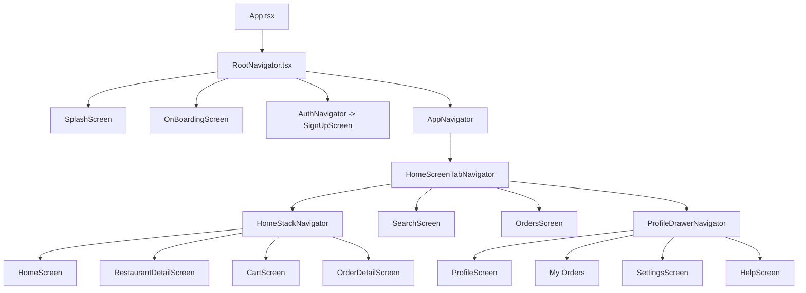

# Bite & Chill

`Bite & Chill` is an Expo React Native food delivery app that behaves like a small product flow instead of a set of disconnected mock screens. The app is still UI-first and uses mock data, but the screens are wired together with real navigation, local persistence, search logic, cart logic, order placement, and deep linking.

## Video Link 
https://ik.imagekit.io/lbndnztj6/VID-20260522-WA0002.mp4?updatedAt=1779457782220

## What The Code Is Doing

At a high level, the app works like this:

1. The app boots into a custom splash screen.
2. After splash, onboarding is always shown first.
3. The user must tap `Get Started` before reaching auth or the main app.
4. Login stores a mock user session in persisted state.
5. The main app opens with bottom tabs.
6. Users can browse restaurants, search dishes, add items to cart, place an order, and see that order saved in the Orders tab even after reload.

There is no backend here. Restaurants, dishes, and profile stats come from local mock data, while auth, cart, and order state are persisted locally with AsyncStorage.

## App Flow



## Entry And Launch Logic

- `App.tsx`
  Creates the `NavigationContainer` and plugs in the linking config.

- `src/navigations/RootNavigator.tsx`
  Controls the startup path. It shows the splash screen first, then forces onboarding, and only after `Get Started` does it move into auth or the main app.

- `src/store/authStore.ts`
  Persists three important pieces of state:
  - whether onboarding is complete
  - whether the user is authenticated
  - the mock user profile

- `src/hooks/useAuth.ts`
  Thin hook used by screens to read and update auth state.

## Navigation Structure

### Root level

- `RootNavigator.tsx`
  Contains `Splash`, `Onboarding`, `Auth`, and `Home`.

### Auth

- `AuthNavigator.tsx`
  Small auth stack used for unauthenticated users.

- `src/screens/auth/SignUpScreen.tsx`
  The login screen. It validates simple fields, saves the mock user, and resets navigation into the main app.

### Main tabs

- `HomeScreenTabNavigator.tsx`
  Hosts the four required tabs:
  - `HomeTab`
  - `SearchTab`
  - `OrdersTab`
  - `ProfileTab`

  It also adds the dynamic Orders badge based on cart item count.

### Home stack

- `HomeStackNavigator.tsx`
  Handles the stack under the Home tab:
  - `HomeMain`
  - `RestaurantDetail`
  - `Cart`
  - `OrderSuccess`

  The tab bar is hidden on the detail and cart-style screens inside this stack.

### Profile drawer

- `ProfileDrawerNavigator.tsx`
  Wraps the Profile area with drawer navigation.

- `CustomDrawerContent.tsx`
  Renders the simple avatar, user name, drawer items, and logout action.

## State And Persistence

### Auth

- `src/store/authStore.ts`
  Persists onboarding completion and login state.

### Cart

- `src/store/cartStore.ts`
  Persists cart items, exposes quantity updates, derives totals, and drives the Orders tab badge.

- `src/hooks/useCart.ts`
  Small hook for cart reads and mutations in screens.

### Orders

- `src/store/orderStore.ts`
  Persists placed orders with AsyncStorage.

- `src/hooks/useOrders.ts`
  Exposes:
  - `placeOrder`
  - `currentOrder`
  - `pastOrders`
  - hydration state

Checkout writes to the order store, clears the cart, and the Orders screen then reads from stored order data. That is why the current order survives an app reload.

## Screen-By-Screen Walkthrough

### Splash

- `src/screens/splash/SplashScreen.tsx`
  Animated launch screen with scooter art, glowing background, and loading dots.

### Onboarding

- `src/screens/onboarding/OnBoardingScreen.tsx`
  Mandatory first stop after splash. The user stays here until pressing `Get Started`.

### Home

- `src/screens/home/HomeScreen.tsx`
  Main discovery screen with:
  - search entry shortcut
  - category chips
  - promo banner
  - popular restaurants
  - top picks

  Tapping the profile avatar switches to the Profile tab and opens the drawer.

### Restaurant Detail

- `src/screens/home/RestaurantDetailScreen.tsx`
  Receives params from Home, Search, or deep links and shows the selected restaurant details and recommended food. Add buttons write directly into the cart store.

### Cart

- `src/screens/home/CartScreen.tsx`
  Shows live cart contents, suggested items, pricing summary, and checkout. `Proceed to Checkout` creates a persisted order and moves to the success screen.

### Order Success

- `src/screens/orders/OrderDetailScreen.tsx`
  Confirmation screen shown after checkout with celebratory UI and follow-up navigation.

### Orders

- `src/screens/orders/OrdersScreen.tsx`
  Reads from the persisted order store.
  - `Current` shows the active placed order
  - `Past` shows archived orders

  This screen is no longer just static mock UI. It is connected to checkout flow.

### Search

- `src/screens/search/SearchScreen.tsx`
  Handles real local filtering for:
  - search terms
  - dishes
  - restaurants

  Tapping a result opens the correct restaurant detail screen. Add buttons on dishes write to cart.

### Profile

- `src/screens/profile/ProfileScreen.tsx`
  Simple user summary screen with a drawer trigger and quick links into the drawer routes.

### Settings And Help

- `src/screens/profile/SettingsScreen.tsx`
- `src/screens/profile/HelpScreen.tsx`

These are supporting routes inside the Profile drawer flow.

## Shared Business Logic

- `src/utils/catalog.ts`
  Central place for:
  - category matching
  - search matching
  - mapping dishes to restaurant detail params
  - mapping dishes into cart line items

This file keeps Home and Search behavior consistent.

- `src/constants/mockData.ts`
  The mock catalog and UI content source. Restaurants, food items, banners, profile stats, and supporting screen content live here.

- `src/navigations/types.ts`
  Typed route params for root stack, auth stack, home stack, tabs, and drawer.

## Deep Linking

- `src/navigations/linking.ts`
  Defines the app linking config.

Current routes include:

- `foodapp://restaurant/123`
- `foodapp://cart`
- `foodapp://order-success/<orderId>`

The restaurant deep link opens the detail screen directly through the nested navigation structure.

## Animation Layer

The app uses:

- `moti`
- `react-native-reanimated`

The animation helpers added for the codebase are:

- `src/components/ui/AnimatedEntrance.tsx`
  Shared staggered reveal wrapper used across Home, Search, Orders, Profile, Cart, and drawer content.

- `src/components/ui/AnimatedBackdrop.tsx`
  Shared floating background orbs used to keep the main app screens feeling alive.

Additional screen-specific animation lives inside Splash, Onboarding, Orders, and the order success flow.

## Folder Guide

```text
src/
  components/
    navigation/   -> custom headers, drawer content, badges
    ui/           -> cards, buttons, search bar, animation helpers
  constants/      -> theme tokens and mock data
  hooks/          -> small wrappers over Zustand stores
  navigations/    -> root stack, tabs, stacks, drawer, linking
  screens/        -> all user-visible screens
  store/          -> auth, cart, splash, order persistence
  types/          -> app and navigation types
  utils/          -> catalog and matching logic
```

## Where To Edit Things

- Add or change restaurants and dishes:
  `src/constants/mockData.ts`

- Change search or category behavior:
  `src/utils/catalog.ts`

- Change launch routing:
  `src/navigations/RootNavigator.tsx`

- Change tab or drawer structure:
  `src/navigations/HomeScreenTabNavigator.tsx`
  `src/navigations/ProfileDrawerNavigator.tsx`

- Change persistence behavior:
  `src/store/authStore.ts`
  `src/store/cartStore.ts`
  `src/store/orderStore.ts`

- Change shared animation behavior:
  `src/components/ui/AnimatedEntrance.tsx`
  `src/components/ui/AnimatedBackdrop.tsx`

## Running Locally

```bash
npm install
npx expo start
```

For specific targets:

```bash
npx expo start --android
npx expo start --ios
npx expo start --web
```

If Metro is holding old transforms, clear it with:

```bash
npx expo start --clear
```

## Summary

This codebase is mainly about connected front-end flow:

- launch gating with splash and onboarding
- persisted mock auth
- nested navigation
- local business logic for search and categories
- cart to order conversion
- persisted current and past orders
- deep links into nested screens
- animated transitions to make the app feel more alive
